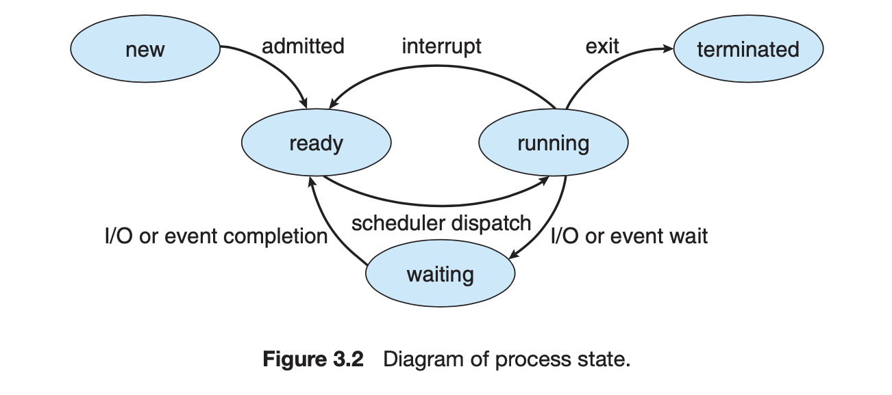
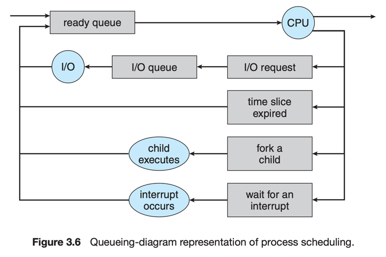

# Operating System Concepts

## Basics

type of os:
- batch
- time sharing
- single user
- multi user
- distributed
- real time
- general purpose

interrupt

## Overview

- System Calls
- System Programs
- OS Design
  - policy vs mechanisms

critical modules that require high performance
- interrupt handler
- i/o manager
- memory manager
- cpu scheduler

two common models of ipc (inter process communication)
- message passing
- shared memory

virtual connections between processes, users, computer systems

**Background Services** are called services / subsystems / daemons 

Operating Systems Structure
- MS-DOS

- Unix

Kernel Provides
- File System
- CPU Scheduling
- Memory Management

**Layered OS**

- One Problem - Overhead system calls
- Another Problem - Designing Layers Order
- Fewer Layers with More Functionality

**MicroKernel** - All Non Essential Parts are moved to system programs and User Space

Mac OSX Darwin is also partly based on the Mach MicroKernel

**Loadable Kernel Modules** - Linking service dynamically

- Architecture of Mac OSX

- Architecture of iOS

- Architecture of Android

OS Debugging

- Log File
- Core Dump
- Crash
- Crash Dump

What Kernel Do in unrecoverable situation?
Save Kernel's Memory state to a section of disk that does not have any `FileSystem`.  When Kernel encounter a unrecoverable error, it take it's entire content of memory or kernel owned part and dump it into disk section. when booting, a process runs and tries to gather the memory dump from the disk and save it as file in filesystem

Trace Listing

System Generation 

- CPU
- Boot Disk
- Memory
- Device
- OS Options

System Boot

- initial bootstrap program

## Process Management

### process

job == process == cpu_activities

- processs in memory
  - text (code/instructions)
  - data (global vars)
  - heap (dynamically allocated)
  - stack (temporary data - function params, return addresses, local vars)
  

- a process itself can be execution environment
  - jvm is a process (which takes java code and take actions via native machine instructions on behalf of that code)
job == process == cpu_activities

*Process State*

- new - created process
- ready - ready to be assigned to processor
- running - instructions are being executed
- waiting - waiting for an event to occur (I/O Completion or reception of a Signal) 
- terminated - finished execution

*Scheduling Queues*

- job queue
- ready queue
- device queue

once the process is allocated to CPU one of the following events may occur

- process issuing I/O request -> I/O Queue -> I/O Happens -> then it placed into the Ready Queue Again (does it stay all the time in CPU if not is it immediately moved to Ready Queue?)
- Time Slice Expired -> Moved to Ready Queue
- Fork A Child -> wait for child's termination
- Wait for an interrupt -> Interrupt Occurs -> then it process from Ready Queue

Process Termination
- removed from all queues
- PCB(process control block) and resources deallocated

## Resources

- [What Happens when we boot a computer](https://www.geeksforgeeks.org/what-happens-when-we-turn-on-computer/)
- [Boot Block](https://www.geeksforgeeks.org/operating-system-boot-block/)
